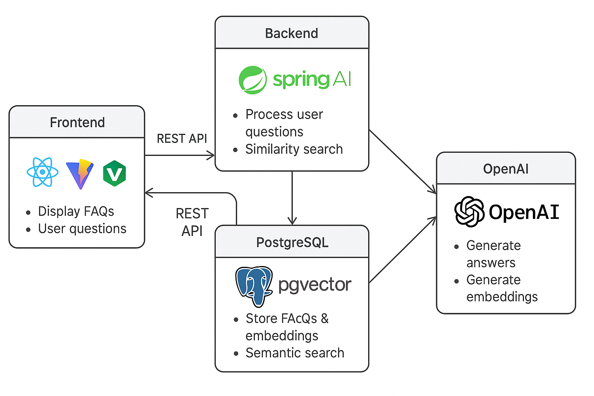

# Spring AI FAQ RAG

A **Retrieval-Augmented Generation (RAG)** application for AI-powered FAQ management, built with:

- **Spring Boot 3.2.4 + Java 23** (Backend)
- **Spring AI** for OpenAI integration
- **pgvector + PostgreSQL** for vector storage and similarity search
- **React + Vite** (Frontend)
- **Nginx** for serving the frontend in production
- **Docker Compose** for orchestration

## Architecture



### Components:

- **Frontend (React + Vite + Nginx)**: Displays FAQs, handles user questions, calls the backend REST API.
- **Backend (Spring Boot + Spring AI)**: Handles REST API requests, processes user questions via OpenAI, performs
  similarity search using pgvector in PostgreSQL.
- **PostgreSQL + pgvector**: Stores FAQs, embeddings, and supports semantic search.
- **OpenAI API**: Generates answers and embeddings for user queries.

---

## Getting Started

### Prerequisites

- **Docker & Docker Compose** installed
- **Java 23** and **Maven 3.9+** (for local development)

---

## Running with Docker Compose

```bash
# Clone the repository
git clone https://github.com/lguberan/springai-faq-rag.git
cd springai-faq-rag

# Set up environment variables
# Edit .env and add your OPENAI_API_KEY

# Build and start all services
docker-compose up --build

# Once all containers are running, open your browser and visit:
- **Frontend**: [http://localhost:5173](http://localhost:5173)
- **Backend API**: [http://localhost:8080/api/faq?validated=true](http://localhost:8080/api/faq?validated=true)
