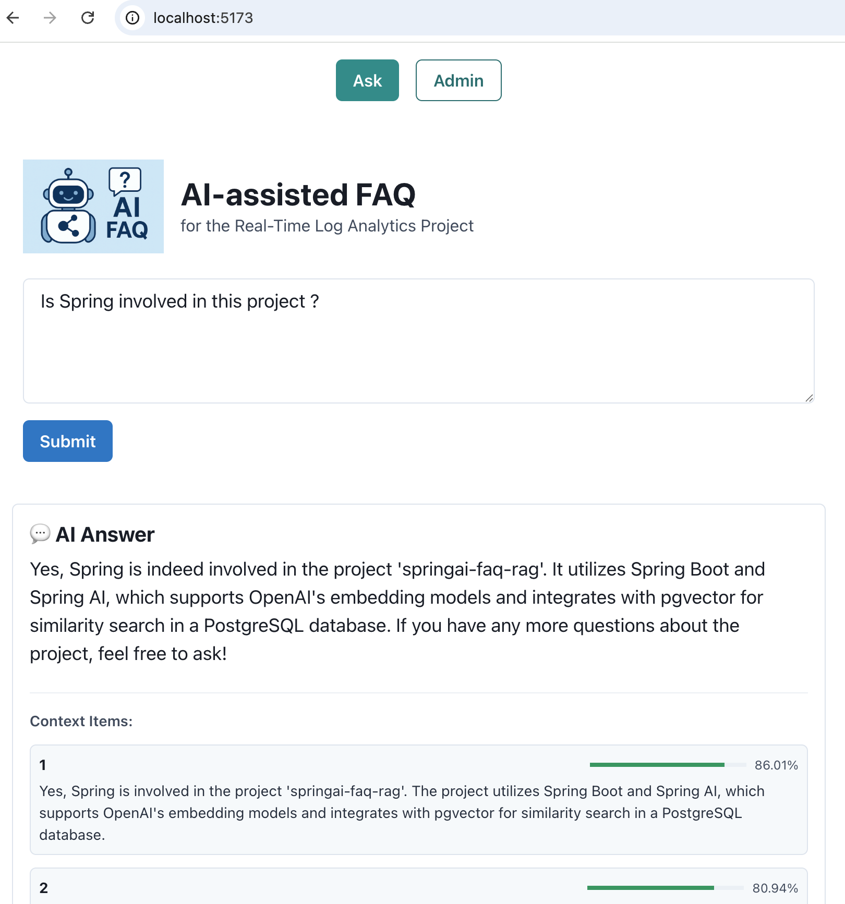
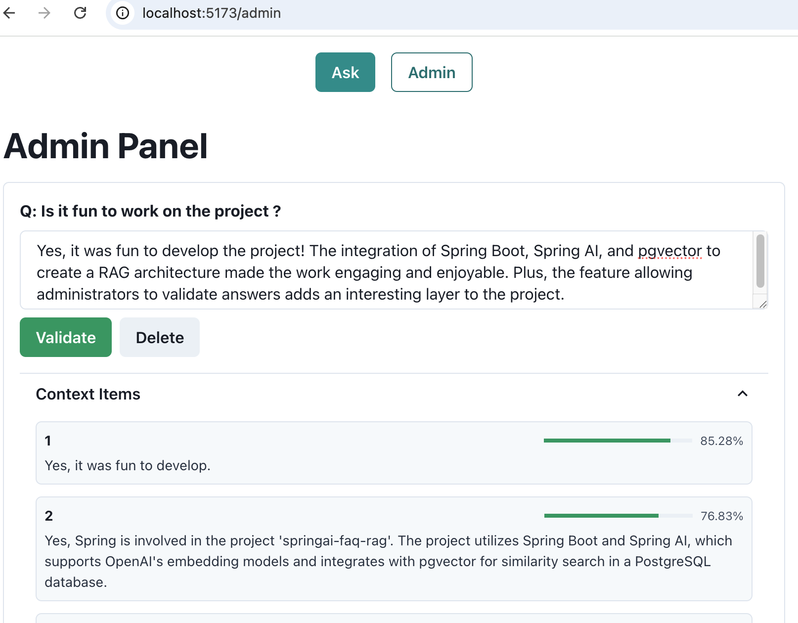

# Spring AI FAQ RAG

## About the Project

This project is a **Retrieval-Augmented Generation (RAG) FAQ system** built with **Spring AI** (currently version
1.0.0-RC1). It demonstrates the integration of:

- **Spring Boot 3.4.5 + Java 17+** (Backend)
- **Spring AI** for OpenAI integration
- **pgvector + PostgreSQL** for vector storage and similarity search
- **React + Vite** (Frontend)
- **Nginx** for serving the frontend in production
- **Docker Compose** for orchestration

It is inspired by [log-analytics-faq-ai](https://github.com/lguberan/log-analytics-faq-ai), which uses Python RAG
libraries. This version replaces the Python backend with a **Java-native solution** using **Spring AI**.

## Architecture


### Components:

- **Frontend (React + Vite + Nginx)**: Displays FAQs, handles user questions, calls the backend REST API.
- **Backend (Spring Boot + Spring AI)**: Handles REST API requests, processes user questions via OpenAI, performs
  similarity search using pgvector in PostgreSQL.
- **PostgreSQL + pgvector**: Stores FAQs, embeddings, and supports semantic search.
- **OpenAI API**: Generates answers and embeddings for user queries.

---

## Getting Started

### Prerequisites

- **[Docker](https://www.docker.com/products/docker-desktop/)**
  and **[Docker Compose](https://docs.docker.com/compose/install/)** installed
- **[Java 17+](https://adoptium.net/)** and **[Maven 3.9+](https://maven.apache.org/)** (for local development)
- An **OpenAI API key** (you can get one at https://platform.openai.com/account/api-keys)

---

### Running with Docker Compose

```bash
# Clone the repository
git clone https://github.com/lguberan/springai-faq-rag.git
cd springai-faq-rag

# Set up environment variables
# Copy the environment template and add your OpenAI API key
cp .env .env.local
# Edit .env.local and set OPENAI_API_KEY=your_actual_api_key_here

# Build and start all services
docker-compose up --build
```

### Running locally for development

```bash
# Set up environment variables
export OPENAI_API_KEY=your_actual_api_key_here
export ADMIN_USERNAME=admin
export ADMIN_PASSWORD=secure_password_here

# Start PostgreSQL with Docker
docker run -d \
  --name postgres-pgvector \
  -e POSTGRES_PASSWORD=postgres \
  -e POSTGRES_DB=postgres \
  -p 5432:5432 \
  pgvector/pgvector:pg17

# Build and run backend
cd backend
./mvnw spring-boot:run

# In another terminal, build and run frontend
cd frontend
npm install
npm run dev
```

### Once all containers are running, open your browser and visit:

- **Frontend**: [http://localhost:5173](http://localhost:5173) (use admin/admin)
- **API doc. Swagger**:  [http://localhost:8080/swagger-ui/index.html](http://localhost:8080/swagger-ui/index.html)
- **Backend API**: [http://localhost:8080/api/faq?validated=true](http://localhost:8080/api/faq?validated=true)
- **pgweb** web-based PostgreSQL client: http://localhost:8081

---

## 🖼️ Screenshots

| Ask Page                | Admin Panel                 |
|-------------------------|-----------------------------|
|  |  |

---

## 📝 API Documentation

The backend provides a RESTful API with OpenAPI/Swagger documentation.

### Key Endpoints

#### Public Endpoints
- `GET /api/faq/ask?question={question}` - Ask a question to the AI system
- `GET /api/faq?validated={true|false}` - List FAQs (optionally filtered by validation status)
- `GET /actuator/health` - Health check endpoint
- `GET /swagger-ui/index.html` - Interactive API documentation

#### Admin Endpoints (requires authentication)
- `PATCH /api/faq/validate` - Validate or correct an AI-generated answer
- `DELETE /api/faq/{id}` - Delete a specific FAQ
- `GET /actuator/**` - Application metrics and monitoring endpoints

### Example Usage

```bash
# Ask a question
curl "http://localhost:8080/api/faq/ask?question=How does Spring AI work?"

# List validated FAQs
curl "http://localhost:8080/api/faq?validated=true"

# Validate an answer (requires admin auth)
curl -X PATCH "http://localhost:8080/api/faq/validate" \
  -u admin:admin \
  -H "Content-Type: application/json" \
  -d '{"id":"123e4567-e89b-12d3-a456-426614174000","answer":"Corrected answer","validated":true}'
```

### Response Format

All endpoints return JSON responses with consistent structure:

```json
{
  "id": "uuid",
  "question": "User question",
  "answer": "AI or validated answer",
  "validated": true,
  "autoGenerated": false,
  "askedAt": "2024-01-01T12:00:00Z",
  "confidenceScore": 0.95,
  "contextItems": [
    {
      "text": "Relevant context",
      "score": 0.85
    }
  ]
}
```

---

## 🔒 Security

### Authentication & Authorization
- Only authenticated users with role `ADMIN` can access the validation and deletion endpoints
- HTTP Basic authentication is enabled for backend API endpoints
- CSRF protection is disabled for API endpoints (suitable for API-only backends)
- Admin credentials can be configured via environment variables:
  - `ADMIN_USERNAME` (default: admin)
  - `ADMIN_PASSWORD` (default: admin)

### Environment Variables
- **Production environments should use strong passwords**
- Store sensitive data like API keys in environment variables, not in code
- The `.env` file is gitignored to prevent accidental commits of secrets

### API Security
- Input validation on all endpoints
- Proper error handling without exposing internal details
- Actuator endpoints are restricted to admin users only (except health and info)

### Recommendations
- Use HTTPS in production
- Implement rate limiting for public endpoints
- Regularly rotate API keys and passwords
- Monitor and log security-related events

---

## 📜 License

This project is open source and available under the MIT License.

[](https://lguberan.github.io/springai-faq-rag)

