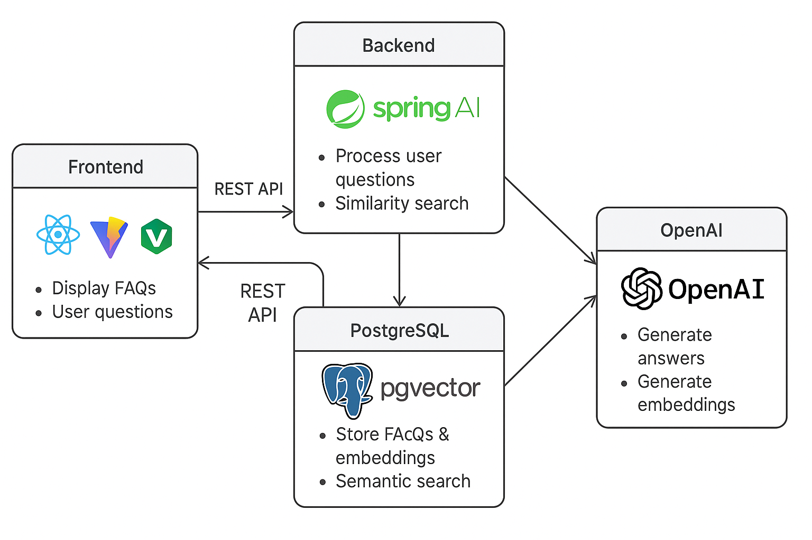
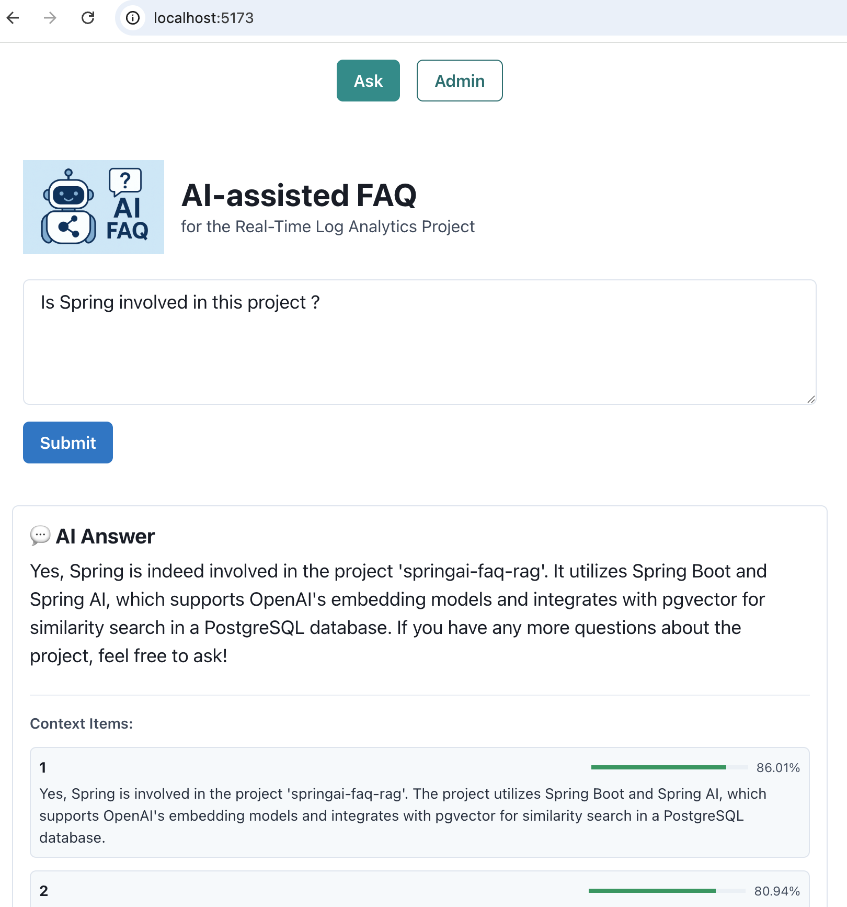
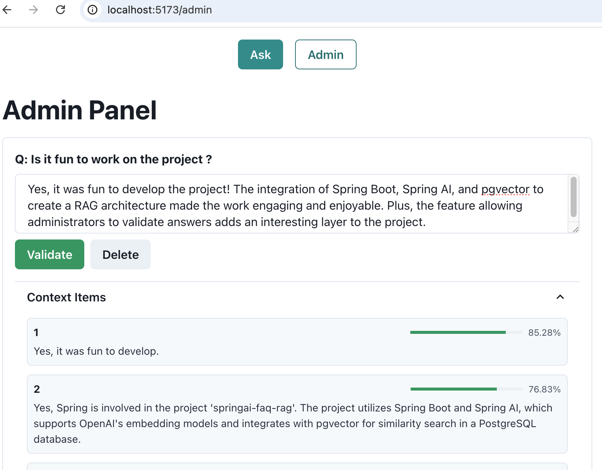

# Spring AI FAQ RAG

A full-stack FAQ application that demonstrates Retrieval-Augmented Generation (RAG) with Spring AI, OpenAI, and
PostgreSQL/pgvector. Users can ask questions, inspect the retrieved context, and review generated answers before adding
them to the validated knowledge base.

The project is inspired by [log-analytics-faq-ai](https://github.com/lguberan/log-analytics-faq-ai). It replaces the
Python backend with a Java-native implementation based on Spring AI.

## How it works

1. On an empty database, the backend seeds sample FAQs and creates their embeddings.
2. A user question triggers a pgvector similarity search over validated FAQ entries.
3. The retrieved entries are supplied to OpenAI as RAG context.
4. The generated answer and its retrieved context are stored as an unvalidated FAQ entry.
5. The admin page can correct and validate the answer, which adds it to the vector store, or delete it.

## Technology stack

| Area              | Technology                                                  |
|-------------------|-------------------------------------------------------------|
| Backend           | Java 25, Spring Boot 4.1.1, Spring AI 2.0.1                 |
| API documentation | springdoc-openapi 3.1.0 / Swagger UI                        |
| AI models         | `gpt-4o-mini`, `text-embedding-3-small` (1,536 dimensions)  |
| Database          | PostgreSQL 18 with pgvector, HNSW index and cosine distance |
| Frontend          | React 19, TypeScript 7, Vite 8, Chakra UI 3                 |
| Build toolchain   | Maven 3.9.16, Node.js 26.7.0, npm                           |
| Runtime           | Docker Compose, Nginx, pgweb                                |

The Maven frontend module and the frontend Docker image both intentionally pin Node.js `26.7.0`.

## Architecture



- **React frontend:** provides the question and review interfaces and calls the REST API.
- **Spring Boot backend:** performs retrieval, calls OpenAI, and manages FAQ validation.
- **PostgreSQL + pgvector:** stores FAQ records and embeddings and performs semantic search.
- **OpenAI API:** creates embeddings and generates grounded answers.

## Run with Docker Compose

### Prerequisites

- [Docker](https://www.docker.com/products/docker-desktop/) with Docker Compose v2
- An [OpenAI API key](https://platform.openai.com/api-keys) with access to the configured chat and embedding models

Export the key in your shell, then build and start the stack:

```bash
export OPENAI_API_KEY="your-api-key"
docker compose up --build
```

Never commit a real API key. The first startup can take longer because the backend seeds the database and requests
embeddings from OpenAI.

### Services

| Service           | URL                                            |
|-------------------|------------------------------------------------|
| Question page     | <http://localhost:5173>                        |
| Admin review page | <http://localhost:5173/admin>                  |
| Swagger UI        | <http://localhost:8080/swagger-ui/index.html>  |
| Validated FAQ API | <http://localhost:8080/api/faq?validated=true> |
| Actuator          | <http://localhost:8080/actuator>               |
| pgweb             | <http://localhost:8081>                        |

Stop the services with:

```bash
docker compose down
```

The named PostgreSQL volume is preserved. Use `docker compose down -v` only when you also want to delete the local
database.

## Local development

Local backend development requires JDK 25, Maven 3.9.16, Docker, and an OpenAI API key. Start PostgreSQL, then run the
backend from the repository root:

```bash
docker compose up -d postgres
export OPENAI_API_KEY="your-api-key"
mvn -pl backend spring-boot:run
```

For frontend development, use Node.js 26.7.0 in another terminal. Vite proxies `/api` to the backend on port 8080:

```bash
cd frontend
npm ci
npm run dev
```

Build and test both Maven modules from the repository root:

```bash
mvn clean verify
```

The backend integration tests use Testcontainers and therefore require a running Docker engine. The Maven frontend
module downloads its pinned Node.js version and builds the React application automatically.

## Main API endpoints

| Method   | Path                             | Purpose                                                      |
|----------|----------------------------------|--------------------------------------------------------------|
| `GET`    | `/api/faq/ask?question=...`      | Retrieve context, generate an answer, and save it for review |
| `GET`    | `/api/faq?validated=true\|false` | List FAQs, optionally filtered by validation status          |
| `PATCH`  | `/api/faq/validate`              | Correct and validate an FAQ answer                           |
| `DELETE` | `/api/faq/{faqId}`               | Delete an FAQ and its vector document                        |
| `POST`   | `/api/auth/login`                | Create an authenticated HTTP session                         |
| `POST`   | `/api/auth/logout`               | End the authenticated HTTP session                           |

See Swagger UI for request and response schemas.

## Configuration

The main configuration is in [`backend/src/main/resources/application.yml`](backend/src/main/resources/application.yml).

| Setting                      | Default or source                           | Description                                                                |
|------------------------------|---------------------------------------------|----------------------------------------------------------------------------|
| `OPENAI_API_KEY`             | Required environment variable               | OpenAI authentication                                                      |
| `SPRING_DATASOURCE_URL`      | `jdbc:postgresql://localhost:5432/postgres` | JDBC connection URL; Docker Compose overrides it for the backend container |
| `SPRING_DATASOURCE_USERNAME` | `postgres`                                  | Database user                                                              |
| `SPRING_DATASOURCE_PASSWORD` | `postgres`                                  | Database password for local development only                               |
| `VITE_API_URL`               | `/api` in `frontend/.env`                   | Frontend API base path                                                     |

The configured RAG retrieval uses the eight closest documents with a similarity threshold of `0.4`.

## Security notice

This repository is currently configured as a **local demonstration**, not as a production-ready deployment:

- CSRF protection is disabled.
- All `/api/faq/**`, `/api/auth/**`, Swagger, and Actuator endpoints are publicly accessible.
- The in-memory `admin` account exists, but the FAQ validation and deletion routes do not currently enforce the `ADMIN`
  role.
- Docker Compose uses development database credentials and all Actuator endpoints are exposed.

Do not expose the application publicly without enabling authorization on modification endpoints, replacing the demo
credentials, restricting Actuator, and reviewing the CSRF/CORS configuration.

## Screenshots

| Ask page                     | Admin panel                       |
|------------------------------|-----------------------------------|
|  |  |

## License

This project is available under the [MIT License](LICENSE).

[](https://lguberan.github.io/springai-faq-rag)
